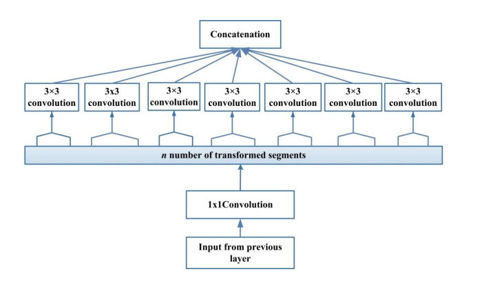
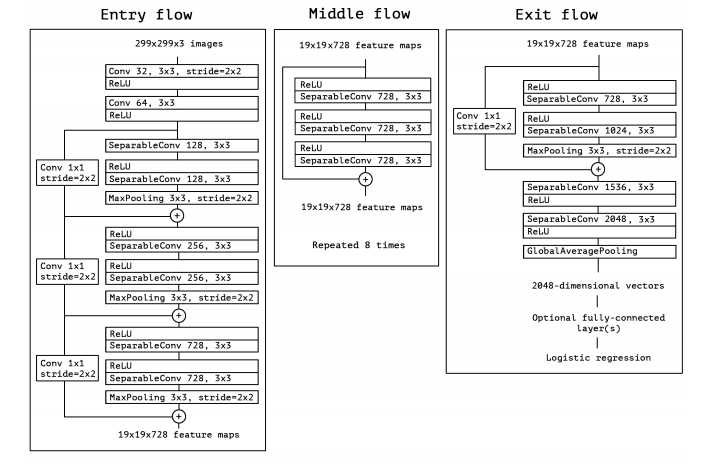

<p align="center">
 <h1>Resumen de Redes Neuronales </h1>
</p>

## 1.-Resnet

<p align="center">
 <br> Imagen1. 
*Residual Learning : a building block* [2]
</p>


### Arquitectura

* Tiene un camino corto de identidad, que evita una o mas capas.
* Formalmente, se denota el mapeo subyacente como:
```
H(x) , x : representa la entrada para la primera de estas capas.
-> H(x) Este mapeo sera ajustado para algunas capas
```
* Define el ajuste del acoplamiento de las capas no lineales a la función residual.
```
Funcion residual: 

F(x) := H(x) - x ( Se asume que la entrada y salida son de las mismas dimensiones )
``` 
* El mapeo general es refundido a 
```
F(x) + x
... Este no se aplica necesariamete a todas las capas
```


### Características

- Introduce el concepto de aprendizaje residual ( *skip connection* )
- 20 y 8 veces mas profunda que AlexNet y VCG respectivamente y posee menos complejidad computacional que estas dos
- Emplea *shortcouts connections*, la cual aplica un mapeo de identidad.
- Basada en la idea de *Highway Network* por usar capas alternas.
- Los links residuales aceleran la convergencia las "deep networks"
- Optimiza el mapeo residual en lugar de optimizar el mapeo original sin referencia.

### Ventajas

- Menos complejidad computacional que la VGG y AlexNet
- Buen desempeño en tarea de reconocimiento y localización de imágenes
- Las funciones residuales son fáciles de optimizar en comparación de la de *Highway Network*
- Evita el problema de la disminución de *vanishing gradients* asi como tambien de *exploding gradients*


## 2.- Highway

### Arquitectura

<p align="center">

<br>
Imagen 2 - Flujo de la información en una Highway [3]
</p>


#### Como funciona:

Tenemos : 
<br>
` x : entrada , w : pesos, H: función activación , y : salida`
- Las Highway poseen dos transformaciones no-lineales: T y C , donde T es la *transformation gate* y la C es la *carry gate*
``` 
y = H(x, W(h)). T(x,w(t)) + x.C(x,W(c))
```
- En particular : 
``` 
C = 1 - T 
```
- Así Tenemos:
``` 
    y = H(x , W(h) ). T(x, w(t)) + x.(1 - T(x,W(t))
```
- Se tiene las siguientes condiciones para T : 
```
    y = x , si T(x,W(t)) = 0 
    y = H(x, w(h)) , si T(x,W(t)) = 0

```
- Cuando T es 0 la información de la entrada se envia a la salida directamente 
- Cuando T es 1 , se usa la transformación no lineal a la entrada.


### Características

- Se categoriza como una Red Neuronal *MultiPath*
- Inspirada por la LSTM
- Posee un mecanismo de *cross-layer connectivity*.
- Se agrega información de la capa L y la información de las capas previas l - j creando un efecto de regularización, haciendo que no cambie gradiente basada en entrenamiento de la red profunda.
- Usa un *padding* de ceros para asegurarse que el bloque de estado y la puerta de transformación del mapa de características sea del mismo tamaño que la entrada.

### Ventajas

- Convergen significativamente más rápido que las redes planas
- Enriquecen representación de caracteristicas e introduce a un nuevo mecanismo de conectividad entre capas
- Permite el entrenamiento de mas de 100 capas , incluso con 900 capas usando el algoritmo de la gradiente descendente estocástica (SGD) 

### Desventajas

* Las variaciones recientes de ResNets muestran que muchas capas contribuyen muy poco y, de hecho, pueden descartarse al azar durante el entrenamiento
* La función de identidad y la salida de H` se combinan por suma, lo que puede impedir el flujo de información en la red.

## 3.- DenseNet
<p align="center">

<br>
Imagen 3 - Estructura de un bloque en DenseNet [6]
</p>

### Arquitectura

* Propone un patrón de conectividad diferente: introduce conexiones directas desde cualquier capa a todas las capas posteriores.
* Consecuentemente: 
```
La capa L, recibe un mapa de caracteristicas de todas las capas predecesoras , x(0), x(1), x(2), ..., x(l-1), como entradas

    x(l) = H(l)([x0,x1,...,x(l-1)])

donde: [x0,x1,...,x(l-1)], se refiere a la concatenación del mapa de caracteristicas producidas en  las capas 0, 1, ... , l-1.
```

### Características

* Se categoriza como una Red Neuronal *MultiPath*
* Cada capa en la red neuronal DenseNet tiene l-conexiones una entre cada capa y sus siguientes capas.
* La red neuronal DenseNet posee L(L+1)/2 conecciones directas.
* Los mapas de características de todas las capas predecesoras son usadas como entradas.    
* Las capas de DenseNet son muy estrechas, agregan solo un pequeño conjunto de mapas de características al "conocimiento colectivo" de la red y mantienen los mapas de características restantes sin cambios, y el clasificador final toma una decisión basado en todos los mapas de características en la red.
* Todas las capas posteriores pueden acceder a los mapas de características aprendidos por cualquiera de las capas de DenseNet lo que fomenta la reutilización de caracteristicas en toda la red y conduce a modelos más compactos.
* Nunca combina las características usando una suma, las combina usando una concatenación

### Ventajas

* Alivianizan el problema del desvanecimiento de la gradiente
* Fomenta el reuso de caracteristicas
* Sustancialmente reduce el número de parámetros
* Posee un flujo mejorado de información y gradientes en toda la red, lo que los hace fáciles de entrenar.
* Las conexiones en la DenseNet tienen un efecto de regularización, que reduce el sobreajuste en tareas con tamaños de conjuntos de entrenamiento más pequeños.

### Desventajas

* Se vuelve paramétricamente costoso con el aumento en una serie de mapas de características

## 4.- Xception

<p align="center">

<br>
Imagen 4 - Estructura de un bloque en Xception [1]
</p>

### Arquitectura

* Xception  es un apilamiento lineal de capas separadas de convolución  en profundidad, con conexiones residuales.
* La información primero va hacia un flujo de entrada, luego se dirige al flujo medio , el cual es repetido 8 veces y finalmente se dirige al flujo de salida
* Todas las capas de convoluciones y las capas de convoluciones separadas son seguidas por un *batch normalization*. Todas las capas de convolucioes separadas usan un multiplicador de profundidad de 1 ( las que estan sin expansión de profundidad )

<p align="center">

<br>
Imagen 5 - Arquitectura de Xception[8]
</p>

### Características

* Arquitectura enteramente basada en *dephwise separable convolution layers*.
* Aprovecha la idea de la convolución separable en profundidad
* Posee 36 capas de convolución formando la extracción de características basada en la red.
* El número de transformaciones de segmento es igual al numero  de mapas de características.
* Xception hace el calculo mas fácil separando las convoluciones de cada mapa de caracteristicas a través de ejes espaciales, que se sigue de una convolución de 1x1 para mejorar la correlación entre canales.
* Las convoluciones separadas son tratadas como Modulos de *Inception* y se ubican en toda la arquitectura de la red.

### Ventajas

* Xception no reduce el número de parametros, esto hace que el aprendizaje sea mas eficiente y dan como resultado un desempeño mejorado.
* Xception es sencillo de definir y modificar debido a su estructura.


### Desventajas

* Requiere usar las conexiones residuales para mejorar la convergencia en terminos de velocidad y el desempeño del resultado.


# Términos

- *Cross-layer connectivity* : Comunicación entre capas permitiendo que una capa acceda a la data de otra para intercambio de la información y una disponible interacción ( cross-layer network )
- *Multipaths*: Pueden sistematicamente conectar una capa con otra evitando alguna capa intermediaria capa para permitir el flujo especializado de información entre capas. Busca resolver el problema del desvanecimiento de la gradiente por hacer que esta misma sea accesible a capas inferiores.
- *Problema de la explosión*: Largos numeros de errores en las gradientes se acumulan y resultan en amplias actualizaciones a los pesos del modelo de red neuronal durante su entrenamiento, causando una pobre predicción y un modelo que no aporta nada util. Para solucionar se aplica gradient clipping y weight regularization, así como otros.
- *Vanishing Gradient*: al contrario del problema de la explosión en cada iteración del entrenamiento se multiplican pequeños números para calcular las gradientes lo cual hace que tiende a ser cero.    

# Referencias :

## Generales:

1. [A Survey of the Recent Architectures of Deep Convolutional Neural Networks](https://arxiv.org/pdf/1901.06032.pdf)

## Resnet
2. [Deep Residual Learning for Image Recognition](https://arxiv.org/pdf/1512.03385.pdf)
3. [An Overview of ResNet and its Variants](https://towardsdatascience.com/an-overview-of-resnet-and-its-variants-5281e2f56035)
## Highway
3. [Review: Highway Networks — Gating Function To Highway (Image Classification)](https://towardsdatascience.com/review-highway-networks-gating-function-to-highway-image-classification-5a33833797b5)
4. [Highway Networks](https://arxiv.org/pdf/1505.00387.pdf)

## DenseNet

5. [Densely Connected Convolutional Networks (DenseNets)](https://arxiv.org/pdf/1608.06993v3.pdf)
6. [Github Densenet](https://arxiv.org/pdf/1608.06993v3.pdf)
7. [Artículo: DenseNet](https://towardsdatascience.com/densenet-2810936aeebb)

## Xception

8. [Xception: Deep Learning With Depthwise Separable Convolutions](http://openaccess.thecvf.com/content_cvpr_2017/papers/Chollet_Xception_Deep_Learning_CVPR_2017_paper.pdf)
9. [Review: Xception — With Depthwise Separable Convolution, Better Than Inception-v3 (Image Classification)](https://towardsdatascience.com/review-xception-with-depthwise-separable-convolution-better-than-inception-v3-image-dc967dd42568)
