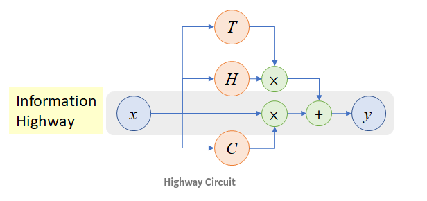

 <h1>Resumen de Redes Neuronales </h1>

## 1.-Resnet

### Arquitectura

* Posee dos puertas ( gate ) : transforma gate y la carry gate

### Características

* Introduco el concepto de aprendisaje residual
* Se categoriza como una Red Neuronal MultiPath

### Ventajas

* Menos complejidad computacional que la VGG y AlexNet 
* Buen desempeño en tarea de reconocimiento y localización de imágenes
* Resuelve y previene parcialmente el problema del desvanecimiento de la gradiente

### Desventajas

## 2.- Highway 

### Arquitectura

* Multi-path 

### Ventajas

*  Enriquecen representación de caracteristicas e introduce a un nuevo mecanismo de conectividad entre capas
*  Convergen significativamente mas rapido que las planas, incluso las que tienene 900 capas

### Desventajas

* Lento entrenamiento y velocidad de convergencia
* El rendimiento decrece cuando se añaden unidades ocultas bajo las 10 capas

## 3.- DenseNet

### Arquitectura

### Ventajas

### Desventajas

## 4.- Xception

### Arquitectura

### Ventajas

### Desventajas

## Terminos

*Cross-layer connectivity : Comunicación entre capas permitiendo que una capa acceda a la data de otra para intercambio de la información y una disponible interacción ( cross-layer network )
* asfasfasf

