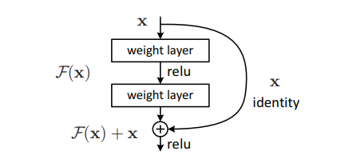

<p align="center">
 <h1>Resumen de Redes Neuronales </h1>
</p>

## 1.-Resnet

<p align="center">
 <br> Imagen1. 
Residual Learning : a building block [2]
</p>


### Arquitectura

* Tiene un camino corto de identidad, que evita una o mas capas.
* Formalmente, se denota el mapeo subyacente como:
```
H(x) , x : representa la entrada para la primera de estas capas.
-> H(x) Este mapeo sera ajustado para algunas capas
```
* Define el ajuste del acoplamiento de las capas no lineaes a la función residual.
```
Funcion residual: 

F(x) := H(x) - x ( Se asume que la entrada y salida son de las mismas dimensiones )
``` 
* El mapeo general es refundido a 
```
F(x) + x
... Este no se aplica a todas las capas
```

### Características

- Introduce el concepto de aprendizaje residual ( skip connection )
- 20 y 8 veces mas profunda que AlexNet y VCG respectivamente y posee menos complejidad computacional que estas dos
- Emplea shortcouts connections, la cual aplica un mapeo de identidad.
- Basada en la idea de Highway Network por usar capas alternas.
- Los links residuales aceleran la convergencia las "deep networks"
- Optimiza el mapeo residual en lugar de optimizar el mapeo original sin referencia.

### Ventajas

- Menos complejidad computacional que la VGG y AlexNet
- Buen desempeño en tarea de reconocimiento y localización de imágenes
- Las funciones residuales son fáciles de optimizar en comparación de la de Highway Network
- Evita el problema de la disminución de "vanishing gradients" asi como tambien de "exploding gradients"


## 2.- Highway

### Arquitectura

<p align="center">

<br>
Imagen 2 - Flujo de la información en una Highway [3]
</p>


#### Como funciona:

Tenemos : 
<br>
` x : entrada , w : pesos, H: función activación , y : salida`
- Las Highway poseen dos transformaciones no-lineales: T y C , donde T es la "transforation gate" y la C es la " carry gate"
``` 
y = H(x, W(h)). T(x,w(t)) + x.C(x,W(c))
```
- En particular : 
``` 
C = 1 - T 
```
- Así Tenemos:
``` 
    y = H(x , W(h) ). T(x, w(t)) + x.(1 - T(x,W(t))
```
- Se tiene las siguientes condiciones para T : 
```
    y = x , si T(x,W(t)) = 0 
    y = H(x, w(h)) , si T(x,W(t)) = 0

```
- Cuando T es 0 la información de la entrada se envia a la salida directamente 
- Cuando T es 1 , se usa la transformación no lineal a la entrada.


### Características

- Se categoriza como una Red Neuronal MultiPath
- Inspirada por la LSTM
- Posee un mecanismo de cross-layer connectivity.
- Hace uso de la función de activación para transformar adaptativamente o evitar la señal para que la red pueda profundizarse
-Se agrega información de la L capa y la información de las capas previas l - j creando un efecto de regularización, haciendo de la gradiente basada en entrenamiento de la red profunda sin cambio.
- Usa un padding de ceros para asegurarse que el bloque de estado y la puerta de transformación del mapa de características sea del mismo tamaño que la entrada.

### Ventajas

- Convergen significativamente más rápido que las redes planas
- Enriquecen representación de caracteristicas e introduce a un nuevo mecanismo de conectividad entre capas
- Permite el entrenamiento de mas de 100 capas , incluso con 900 capas usando el algoritmo de la gradiente descendente estocástica (SGD) 


## 3.- DenseNet

### Arquitectura

### Ventajas

### Características

### Desventajas

## 4.- Xception

### Arquitectura

### Ventajas

### Desventajas

# Términos

- Cross-layer connectivity : Comunicación entre capas permitiendo que una capa acceda a la data de otra para intercambio de la información y una disponible interacción ( cross-layer network )
- Multipaths: Pueden sistematicamente conectar una capa con otra evitando alguna capa intermediaria capa para permitir el flujo especializado de información entre capas. Busca resolver el problema del desvanecimiento de la gradiente por hacer que esta misma sea accesible a capas inferiores.
* Explosion Problem: largos numeros de errores en las gradientes se acumulan y resulta en amplias actualizaciones a los pesos del modelo de red neuronal durante su entrenamiento, causando una pobre predicción y un modelo que no aporta
nada util. Para solucionar se aplica gradient clipping y weight regularization, como otros.
* Vanishing Gradient: al contrario del problema de la explosión en cada iteración del entrenamiento se multiplican pequeños numeros para calcular las gradientes lo cual hace que empiece a ser cero.

# Referencias :

## Generales:

1. [A Survey of the Recent Architectures of Deep Convolutional Neural Networks](https://arxiv.org/pdf/1901.06032.pdf)


## Resnet
2. [Deep Residual Learning for Image Recognition](https://arxiv.org/pdf/1512.03385.pdf)
3. [An Overview of ResNet and its Variants](https://towardsdatascience.com/an-overview-of-resnet-and-its-variants-5281e2f56035)
## Highway
3.  https://towardsdatascience.com/review-highway-networks-gating-function-to-highway-image-classification-5a33833797b5
4. [Highway Networks](https://arxiv.org/pdf/1505.00387.pdf)

## DenseNet